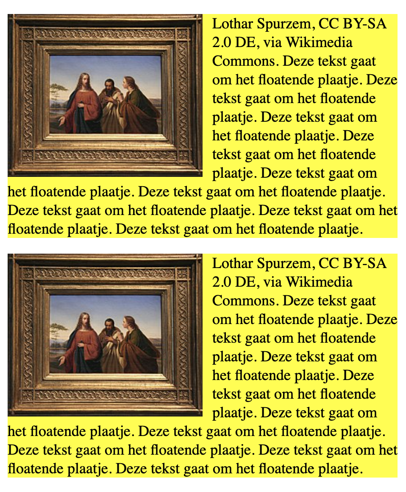

# Floating image met tekst er omheen



Hoe maak je een plaatje met tekst er omheen?

Dit kun je bijvoorbeeld gebruiken als je een pagina maakt met boeken, artiesten enzovoort waarbij je voor elk boek of elke artiest een plaatje met een stukje tekst ernaast wilt.

Een stukje HTML:

```html
<body>
  
  <p>
    Deze eerste tekst gaat om het floatende eerste plaatje. 
  </p>
  <div class="floatClear"></div>

  
  <p>
    Deze tweede tekst gaat om het floatende tweede plaatje. 
  </p>
  <div class="floatClear"></div>    
</body>
```

Een stukje CSS:

```css
body {
  width: 400px;
}

.floatLeft {
  float: left;
  margin-right: 10px;
  width: 200px;
}

.floatClear {
  clear: both;
}
```  

Vergeet niet om de clear na de tekst op te nemen.

Voorbeeld in repl.it:
<iframe height="400px" width="100%" src="https://repl.it/@emmauscollege/floatPlaatje?lite=true" scrolling="no" frameborder="no" allowtransparency="true" allowfullscreen="true" sandbox="allow-forms allow-pointer-lock allow-popups allow-same-origin allow-scripts allow-modals"></iframe>
